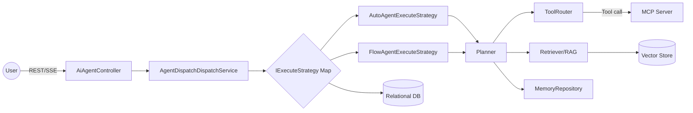
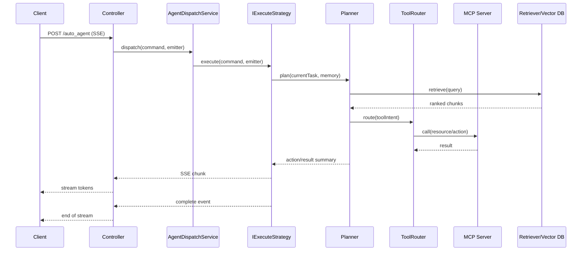

建议保存为 docs/guide.md
1) 项目鸟瞰
本系统以 Spring Boot 为承载，围绕 RAG、MCP 与 Agent 三阶段能力构建统一的智能体工作台：触发层通过 `AiAgentController` 提供 REST/SSE 接口，域层以策略树装配与调度执行智能体，基础设施层完成知识与工具的持久化映射，目标是在不同执行策略和外部模型之间实现可观测、可审计、可扩展的智能任务协作闭环。





《假设清单》
- 现有仓库尚未暴露完整的 RAG ingest 流程与 Retriever 实现，以下建议默认后续会补齐该模块。
- MCP Server 的资源清单与鉴权策略未在仓库暴露，建议按照最小权限原则补全。
- 运行时线程池与缓存配置未在 `application.yml` 中发现，文档中给出的配置片段视为建议。
- 外部模型（Ollama DeepSeek / OpenAI）调用细节未在仓库中实现，以下示例默认通过适配器完成。
- 项目未展示完整的指标/日志/Tracing 方案，改进建议基于常见 Spring Observability 体系。

2) 设计模式索引表
| 模式 | 位置 | 作用 | 可替代方案 | 选择理由 | 风险 & 缓解 |
| --- | --- | --- | --- | --- | --- |
| Strategy | ai-agent-station-study-domain/src/main/java/cn/bugstack/ai/domain/agent/service/dispatch/AgentDispatchDispatchService.java:28 | 以 `strategy` 字段驱动执行策略选择，实现多执行路径扩展 | if-else 分支、反射调用 | Map 注入 + `@Service("beanName")` 避免分支膨胀，天然支持自定义策略 | 策略名与配置不一致导致 NPE → 在存储层加入枚举校验和启动时自检 |
| Factory | ai-agent-station-study-domain/src/main/java/cn/bugstack/ai/domain/agent/service/armory/node/factory/DefaultArmoryStrategyFactory.java:22 | 统一创建 Armory 装配策略树，屏蔽节点依赖 | 直接 new Node 链 | 工厂封装 `StrategyHandler` 组合，便于替换树结构 | 工厂 bean 注入失败 → 在 `AiAgentAutoConfiguration` 启动时加入健康检查 |
| Chain/Tree of Responsibility | ai-agent-station-study-domain/src/main/java/cn/bugstack/ai/domain/agent/service/armory/node/RootNode.java:21 | 多节点依次（可并行）装配 client/model/tool | 纯粹管道或事件总线 | `AbstractMultiThreadStrategyRouter` 支持并行、路由与动态上下文 | 节点链路复杂难以观测 → 在 DynamicContext 中追加 tracingId 并输出日志/指标 |
| Template Method | ai-agent-station-study-domain/src/main/java/cn/bugstack/ai/domain/agent/service/armory/node/AbstractArmorySupport.java:25 | 统一多线程、Bean 注册模板，子类只实现差异化逻辑 | AOP 拦截或工具类 | 模板方法保证装配节点遵循同一生命周期 | 父类隐式依赖太多 → 文档化 required-beans，并通过 `@RequiredArgsConstructor` 显式注入 |
| Builder + Command | ai-agent-station-study-domain/src/main/java/cn/bugstack/ai/domain/agent/model/entity/ArmoryCommandEntity.java:17 & ai-agent-station-study-domain/src/main/java/cn/bugstack/ai/domain/agent/service/armory/ArmoryService.java:58 | 使用命令实体携带装配上下文，Builder 减少构造参数噪声 | Map 传参 | Command 对象便于扩展命令类型与序列化 | Builder 滥用→约束字段校验，配合 Bean Validation |
| Repository (Port-Adapter) | ai-agent-station-study-infrastructure/src/main/java/cn/bugstack/ai/infrastructure/adapter/repository/AgentRepository.java:27 | 解耦领域与 DAO，聚合多表查询 | 直接调用 MyBatis/Mapper | 保留 DDD 仓储语义，便于切换数据源 | 仓储过大 → 拆分子仓储或采用领域服务组合查询 |

RAG/MCP/Agent 取舍表
| 选项 | 优点 | 缺点 | 适用场景 | 本项目选择 | 风险 | 缓解 |
| --- | --- | --- | --- | --- | --- | --- |
| 向量库 - pgvector | 内嵌 PostgreSQL 生态、事务支持强 | 向量算子需调优、扩展性有限 | 中小规模知识库、快速落地 | 待落地，建议首选 pgvector 以复用现有关系库 | 大规模检索性能不足 | 分片 + ANN 索引，热点分库 |
| 向量库 - Elasticsearch | 多模检索、生态成熟 | 维护成本高、写入延迟 | 多模态、日志结合搜索 | 可作为阶段二扩展选项 | 集群成本高 | 采用 Cloud 托管、冷热分层 |
| 向量库 - OpenSearch | AWS 友好、兼容 ES API | 国内部署复杂 | 公有云 + SaaS | 仅在上云场景考虑 | API 差异 | 通过适配器封装检索接口 |
| 检索器 - BM25 | 传统关键词检索稳健 | 语义召回弱 | 结构化文档首屏召回 | 结合 Hybrid 作为基线 | 语义缺失 | 与向量召回融合 |
| 检索器 - Hybrid (BM25+向量) | 兼顾关键词与语义 | 组合复杂度提高 | 需要召回精度 | 推荐默认方案 | 权重调优难 | 采用 RRF/学习排序，定期评估 |
| 检索器 - RRF | 简单融合多个排序器 | 对分值分布敏感 | 多检索融合 | 作为评测工具 | 分值漂移 | 归一化和自动化调参 |
| 分块策略 - 固定窗口 | 实现简单 | 语义割裂 | 结构化文本 | 用于代码块/规则文档 | 上下文丢失 | 重叠窗口 + 段落合并 |
| 分块策略 - 语义分段 | 语义连贯 | 依赖模型 | 自由文本、FAQ | 建议结合 LLM 分段 | 模型成本 | 线下批处理、缓存结果 |
| Summarization 前置 | 减小数据量 | 可能丢关键信息 | 历史日志、长报表 | 针对 MCP 日志可用 | 信息损失 | 保留原文引用 |
| Summarization 中间 | 动态总结 | 多次模型调用 | 多轮任务 | 默认 Agent 推理阶段使用 | 成本高 | 采用增量摘要 |
| Summarization 后置 | 输出一致 | 反馈延迟 | 最终答复 | 对话结束统一总结 | 无法纠错 | 引入用户确认回路 |
| 工具路由 - 规则 | 可预测 | 难扩展 | 高风险操作 | 对安全敏感工具使用 | 规则僵硬 | 定期回顾、加入 feature flag |
| 工具路由 - LLM | 自适应 | 需提示调教 | 多工具探索 | 默认策略 | 幻觉路由 | Few-shot + 反馈日志 |
| 工具路由 - 混合 | 兼顾灵活与安全 | 实现复杂 | 需要分层控制 | 推荐：规则兜底 + LLM | 策略冲突 | 定义优先级，埋点监控 |
| MCP 资源/权限 - 最小集 | 安全可控 | 功能受限 | 上线初期 | 建议白名单 + 审计 | 能力不足 | 分阶段扩展权限 |
| MCP 审计 - 全量日志 | 可追溯 | 存储压力 | 合规场景 | 默认记录关键字段 | 日志泄漏 | 敏感脱敏 + 访问控制 |
| 模型 - Ollama DeepSeek | 本地化、成本低 | 需算力 | 内部研发 | 建议离线推理/微调 | 性能波动 | 监控推理延迟 |
| 模型 - OpenAI GPT 系列 | 质量稳定 | 成本高、网络依赖 | 精准回答、评估 | 作为混合补充 | 合规与 SLA | 加入缓存与降级策略 |

3) 编程思想与原则映射
| 理念 | 当前体现 | 改进建议 |
| --- | --- | --- |
| SOLID | `AgentDispatchDispatchService` 通过策略映射解耦 (`ai-agent-station-study-domain/src/main/java/cn/bugstack/ai/domain/agent/service/dispatch/AgentDispatchDispatchService.java:28`) | 为 `IExecuteStrategy` 引入单一职责文档与集成测试，确保新策略遵循同一接口契约 |
| DDD 实体/值对象 | 值对象 `AiAgentVO`、实体 `ArmoryCommandEntity` 区分清晰 (`ai-agent-station-study-domain/src/main/java/cn/bugstack/ai/domain/agent/model/entity/ArmoryCommandEntity.java:17`) | 聚合边界与不变量尚未明确，建议补充领域事件/聚合根文档 |
| 六边形架构 | 模块分为 domain/app/adapter/infra，对外适配器位于 trigger 包 | 在模块层加入 usecase 层接口，避免 controller 直接依赖 domain service |
| CQRS/事件 | 查询与命令尚未分离，`queryAvailableAgents` 与装配混在同一服务 (`ArmoryService.java:34`) | 引入应用服务拆分命令/查询接口，必要时配合事件通知异步装配 |
| 事务边界 | 仓储层集中操作多个 DAO (`AgentRepository.java:62`) | 为跨 DAO 操作补充事务注解，并标注超时/重试策略 |
| 异常与错误码 | Controller 使用统一 `ResponseCode` (`AiAgentController.java:94`) | 透传 BizException 信息，补齐全局异常处理与错误码字典 |
| 幂等性 | `ArmoryService.acceptArmoryAgent` 目前无防重 | 添加装配状态缓存或版本号，避免重复注册 Bean |
| 可观测性 | 关键路径打日志 (`FlowAgentExecuteStrategy.java:34`) | 引入 Micrometer + OpenTelemetry 埋点，记录策略选择、工具调用成功率 |
| 安全/鉴权/限流 | 暂未实现鉴权 (`AiAgentController` 无权限控制) | 在 trigger 层增加认证拦截器 + 速率限制，MCP 调用需审计与签名 |

4) 从 0 到 1 的设计工作流（步骤+产物+通过标准）
| 步骤 | 核心活动 | 产物 | 通过标准 |
| --- | --- | --- | --- |
| S1 需求澄清 | 拆解业务目标、边界、约束 | 需求澄清表、冲突清单 | 所有利害关系人确认范围 |
| S2 领域语言 | 定义术语、上下文 | 术语表、上下文边界描述 | 关键术语在文档中唯一含义 |
| S3 领域建模 | 识别聚合、用例、领域事件 | C4 Model、用例图、事件风暴记录 | 核心用例覆盖 80% 需求场景 |
| S4 输入/输出端口 | 列出现有系统交互接口 | UseCase 输入/输出契约、接口草图 | 每个用例有明确 caller/callee |
| S5 适配器设计 | 为 Web/AI/DB/MCP 定义适配器职责 | Adapter 责任表、接口对照表 | Adapter 与 Port 一一映射 |
| S6 Agent 能力 | 列出工具、工作流、Planner 策略 | Agent 能力矩阵、Tool 列表 | 工具权限与场景匹配 |
| S7 Prompt & 评测 | 定义 Prompt 模板、评测指标 | Prompt 说明书、评测计划 | 通过 smoke test/自动评测基线 |
| S8 NFR | 性能、安全、成本、可维护性设计 | NFR 表、容量估算、监控方案 | 关键 NFR 有量化指标与监控 |
| S9 发布/回滚 | 制订上线、灰度、回滚策略 | 发布 Runbook、回滚脚本 | 演练至少 1 次成功 |

设计数据库表的触发条件与示例
- 当存在跨用例共享状态且需追踪历史（如工具调用结果）时立刻建表。
- 对账/审计需要强一致日志。
- 需要生成报表或统计的结构化数据。
- 模型/工具配置需要多环境版本管理。

示例表结构（Agent 执行记录）：
| 字段 | 类型 | 约束 | 说明 |
| --- | --- | --- | --- |
| id | bigint | PK，自增 | 记录 ID |
| agent_id | varchar(64) | NOT NULL，index idx_agent_time | 执行的 Agent |
| session_id | varchar(128) | NOT NULL，唯一约束 uniq_session_step 与 step | 会话标识 |
| step | int | NOT NULL | 执行步数 |
| status | varchar(32) | NOT NULL | running/success/failed |
| payload | jsonb | NULL | 工具调用入参 |
| result | jsonb | NULL | 返回结果 |
| created_at | timestamp | DEFAULT now() | 创建时间 |
| updated_at | timestamp | DEFAULT now() | 更新时间 |

Liquibase YAML 脚手架：
```yaml
databaseChangeLog:
  - changeSet:
      id: 20250208-01-agent-exec
      author: codex
      changes:
        - createTable:
            tableName: agent_execution
            columns:
              - column:
                  name: id
                  type: BIGINT
                  autoIncrement: true
                  constraints:
                    primaryKey: true
              - column:
                  name: agent_id
                  type: VARCHAR(64)
                  constraints:
                    nullable: false
              - column:
                  name: session_id
                  type: VARCHAR(128)
                  constraints:
                    nullable: false
              - column:
                  name: step
                  type: INT
                  constraints:
                    nullable: false
              - column:
                  name: status
                  type: VARCHAR(32)
                  constraints:
                    nullable: false
              - column:
                  name: payload
                  type: JSONB
              - column:
                  name: result
                  type: JSONB
              - column:
                  name: created_at
                  type: TIMESTAMP
                  defaultValueComputed: CURRENT_TIMESTAMP
              - column:
                  name: updated_at
                  type: TIMESTAMP
                  defaultValueComputed: CURRENT_TIMESTAMP
        - addUniqueConstraint:
            tableName: agent_execution
            columnNames: session_id, step
            constraintName: uniq_session_step
        - createIndex:
            tableName: agent_execution
            indexName: idx_agent_time
            columns:
              - column:
                  name: agent_id
```

设计接口的触发条件与 OpenAPI 草案
- 存在对外消费者或跨团队协作需要明确契约时。
- 需要前端/第三方提前 Mock。
- 接口稳定度高、需版本管理。
- 涉及安全审计或 SLA 场景。

OpenAPI v3 草案示例：
```yaml
openapi: 3.0.3
info:
  title: AI Agent Orchestrator API
  version: 0.1.0
paths:
  /api/v1/agent/auto_agent:
    post:
      summary: Stream agent execution
      requestBody:
        required: true
        content:
          application/json:
            schema:
              $ref: '#/components/schemas/AutoAgentRequest'
      responses:
        '200':
          description: SSE stream started
          content:
            text/event-stream:
              schema:
                type: string
  /api/v1/agent/query_available_agents:
    get:
      summary: List available agents
      responses:
        '200':
          description: OK
          content:
            application/json:
              schema:
                $ref: '#/components/schemas/AgentListResponse'
components:
  schemas:
    AutoAgentRequest:
      type: object
      required: [aiAgentId, message, sessionId]
      properties:
        aiAgentId:
          type: string
        message:
          type: string
        sessionId:
          type: string
        maxStep:
          type: integer
          default: 4
    AgentListResponse:
      type: object
      required: [code, data]
      properties:
        code:
          type: string
        info:
          type: string
        data:
          type: array
          items:
            $ref: '#/components/schemas/AgentDescriptor'
    AgentDescriptor:
      type: object
      properties:
        agentId:
          type: string
        agentName:
          type: string
        description:
          type: string
        channel:
          type: string
        strategy:
          type: string
        status:
          type: integer
```

5) 文档模板（骨架）
PRD 摘要模板：
```markdown
# PRD 摘要
## 背景
- 业务目标：
- 成功指标：

## 用户画像
- 角色：
- 痛点：

## 核心场景
1.
2.

## 约束与边界
- 技术：
- 合规：

## 验收标准
- 功能：
- NFR：
```

用例规约模板：
```markdown
# 用例 UC-XX：{名称}
- 参与者：
- 触发条件：
- 前置条件：
- 主成功场景：
  1.
  2.
- 备选场景：
- 业务规则：
- 数据需求：
```

领域上下文图（Mermaid C4 草案）：
```mermaid
C4Context
title RAG + MCP + Agent Context
Person(dev, Developer)
System_Boundary(core, "AI Agent Station") {
  Container(app, "Trigger API", "Spring MVC", "Expose REST/SSE")
  Container(domain, "Domain Core", "Spring", "Agent orchestration & planning")
  ContainerDb(db, "Operational DB", "PostgreSQL", "Agents, tools, tasks")
  Container(mcp, "MCP Gateway", "gRPC/HTTP", "Expose internal services")
  Container(vector, "Vector Store", "pgvector", "Knowledge embeddings")
}
dev -> app : define prompts / call APIs
app -> domain : dispatch commands
domain -> vector : retrieve context
domain -> mcp : invoke tools/logs
domain -> db : store states
```

词汇表模板：
```markdown
# 词汇表
| 名称 | 定义 | 备注 |
| --- | --- | --- |
| Agent |  |
| Tool |  |
| MCP |  |
| Session |  |
```

架构决策记录（ADR）模板：
```markdown
# ADR {序号}: {标题}
- 状态：提议中 / 已接受 / 已废弃
- 背景：
- 决策：
- 备选方案：
- 影响：
- 后续行动：
```

OpenAPI 草案模板：
```yaml
openapi: 3.0.3
info:
  title: {Service}
  version: {X.Y.Z}
servers:
  - url: https://{env}.example.com
paths:
  /resource:
    get:
      summary: Describe
      responses:
        '200':
          description: OK
components:
  schemas: {}
```

Runbook 模板：
```markdown
# Runbook - {服务}
## 上线前检查
- [ ] 配置完成
- [ ] 测试通过

## 常见告警
| 告警 | 处理步骤 | 升级路径 |
| --- | --- | --- |

## 回滚
- 条件：
- 步骤：
```

数据字典与审计策略模板：
```markdown
# 数据字典
| 表名 | 字段 | 类型 | 约束 | 敏感级别 |

# 审计策略
- 记录范围：
- 保留周期：
- 授权：
```

评测计划（RAG/Agent/MCP）模板：
```markdown
# 评测计划
## RAG
- 数据集：
- 指标：Recall@k、MRR
- 流程：

## Agent
- 任务集：
- 指标：成功率、平均步数
- 评测工具：

## MCP
- 可用性：
- 安全审计：
- 性能压测：
```

6) 代码起步骨架（Java 包结构 + 关键接口签名）
建议包结构：
```text
cn.bugstack.ai
 ├─ app
 │   ├─ AiAgentApplication
 │   └─ config
 ├─ domain
 │   ├─ agent
 │   │   ├─ entity
 │   │   ├─ valueobject
 │   │   ├─ service
 │   │   └─ event
 │   └─ common
 ├─ usecase
 │   ├─ port
 │   │   ├─ inbound
 │   │   └─ outbound
 │   └─ executor
 ├─ adapter
 │   ├─ web
 │   ├─ ai
 │   ├─ db
 │   └─ mcp
 └─ infra
     ├─ config
     ├─ observability
     └─ security
```

关键接口示例：
```java
package cn.bugstack.ai.domain.tool;

public interface Tool {
    String name();
    ToolResult invoke(ToolRequest request);
}
```

```java
package cn.bugstack.ai.domain.tool;

public interface ToolRouter {
    ToolSelection route(PlannerIntent intent, AgentContext context);
}
```

```java
package cn.bugstack.ai.domain.planner;

public interface Planner {
    PlanResult plan(PlanCommand command, AgentContext context);
}
```

```java
package cn.bugstack.ai.domain.memory;

public interface MemoryRepository {
    ConversationState load(String sessionId);
    void append(String sessionId, MemoryItem item);
}
```

```java
package cn.bugstack.ai.domain.retriever;

public interface Retriever {
    RetrievalResult retrieve(RetrievalQuery query);
}
```

```java
package cn.bugstack.ai.usecase.agent;

public interface AgentOrchestrator {
    void execute(AgentCommand command, AgentOutputPort outputPort);
}
```

```java
package cn.bugstack.ai.usecase.shared;

public interface UseCase<I, O> {
    void execute(I input, O outputPort);
}
```

`AgentOrchestrator` 脚手架：
```java
package cn.bugstack.ai.usecase.agent;

import cn.bugstack.ai.domain.planner.Planner;
import cn.bugstack.ai.domain.tool.ToolRouter;
import cn.bugstack.ai.domain.memory.MemoryRepository;
import cn.bugstack.ai.domain.retriever.Retriever;

public class DefaultAgentOrchestrator implements AgentOrchestrator {

    private final Planner planner;
    private final ToolRouter toolRouter;
    private final MemoryRepository memoryRepository;
    private final Retriever retriever;

    public DefaultAgentOrchestrator(Planner planner,
                                    ToolRouter toolRouter,
                                    MemoryRepository memoryRepository,
                                    Retriever retriever) {
        this.planner = planner;
        this.toolRouter = toolRouter;
        this.memoryRepository = memoryRepository;
        this.retriever = retriever;
    }

    @Override
    public void execute(AgentCommand command, AgentOutputPort outputPort) {
        AgentContext context = memoryRepository.load(command.sessionId());
        PlanResult plan = planner.plan(command.toPlanCommand(), context);
        plan.steps().forEach(step -> {
            RetrievalResult retrieval = retriever.retrieve(step.toRetrievalQuery());
            ToolSelection selection = toolRouter.route(step.intent(), context.with(retrieval));
            ToolResult result = selection.tool().invoke(selection.toRequest(step, retrieval));
            outputPort.onStep(step, result);
            memoryRepository.append(command.sessionId(), MemoryItem.from(step, result));
        });
        outputPort.onCompleted();
    }
}
```

配置示例：
```yaml
spring:
  application:
    name: ai-agent-station
  ai:
    agent:
      auto-config:
        enabled: true
        preload-agents:
          - agentId: flow-agent
            strategy: flowAgentExecuteStrategy
executor:
  agent:
    core-size: 8
    max-size: 32
    queue-capacity: 200
vector:
  provider: pgvector
  connection:
    url: jdbc:postgresql://localhost:5432/rag
mcp:
  endpoints:
    observability: http://mcp.local/logs
    ops: http://mcp.local/ops
```

最小可运行 Main：
```java
package cn.bugstack.ai.app;

import org.springframework.boot.SpringApplication;
import org.springframework.boot.autoconfigure.SpringBootApplication;

@SpringBootApplication
public class AiAgentApplication {
    public static void main(String[] args) {
        SpringApplication.run(AiAgentApplication.class, args);
    }
}
```

7) 学习与迁移清单
读代码 → 抽象模式 → 套用到我的上下文
1. 按层阅读（trigger → domain → infra），记录依赖方向。
2. 摘录可复用模式（策略树、仓储、Builder），标注触发条件。
3. 将模式映射到自身业务场景，绘制差异清单。
4. 以最小用例试水，编写回归测试验证适配度。

反模式清单
| 反模式 | 风险 | 规避策略 |
| --- | --- | --- |
| 过早抽象 | 模块不成熟导致扩展困难 | 以用例驱动抽象，验收后再上升 |
| 过度通用 | 复杂度飙升，难维护 | 写明适用范围，引入 ADR 说明 |
| 混淆领域与应用服务 | 依赖倒置，测试困难 | 引入 usecase 层，控制依赖方向 |
| 把 LLM 当黑盒无评测 | 输出不可控 | 建立离线评测与在线监控 |

渐进式重构 3 步
1. 可观测性：补齐日志、Tracing、指标基线。
2. 契约稳定：固化 OpenAPI、UseCase 契约并引入 Contract Test。
3. 抽象沉淀：将重复逻辑下沉为策略/模板，配合 ADR 记录。

两周练习计划（每日 1 小时）
| 周 | 日 | 主题 | 内容 |
| --- | --- | --- | --- |
| 第1周 | 1 | 需求拆分 | 选取用例撰写用例规约 |
| 第1周 | 2 | 代码阅读 | 深入 `ArmoryService` 策略链 |
| 第1周 | 3 | 模式总结 | 编写 Strategy/Factory 小结 |
| 第1周 | 4 | Prompt 设计 | 为一个工具设计 prompt 模板 |
| 第1周 | 5 | RAG 实践 | 使用 pgvector 构建索引 Demo |
| 第1周 | 6 | 评测 | 搭建简单回归评测脚本 |
| 第1周 | 7 | 复盘 | 总结问题与改进点 |
| 第2周 | 8 | MCP 调研 | 列出预期资源/权限 |
| 第2周 | 9 | 接口设计 | 完成 OpenAPI 草案并评审 |
| 第2周 | 10 | 数据建模 | 设计 agent_execution 表并生成 Liquibase |
| 第2周 | 11 | UseCase 实现 | 实作 AgentOrchestrator 骨架 |
| 第2周 | 12 | 测试 | 编写策略路由单测 + SSE 集成测试 |
| 第2周 | 13 | Observability | 加入 Micrometer 指标 Demo |
| 第2周 | 14 | 复盘 | 编写 ADR、更新学习清单 |

8) 验收与评估
Rubric（0~5 分）
| 评分项 | 0 分 | 3 分 | 5 分 |
| --- | --- | --- | --- |
| 覆盖面 | 仅关注单模块 | 涵盖主流程 | 覆盖 RAG/MCP/Agent 全生命周期 |
| 深度 | 无架构分析 | 基本说明模式 | 深入取舍、风险与缓解 |
| 准确性 | 存在重大误判 | 少量偏差 | 全部对齐代码实现或标注假设 |
| 可操作性 | 纯概念 | 有部分模板 | 模板+脚手架可直接落地 |
| 可复用性 | 场景特化 | 适用于本项目 | 可迁移到同类项目并含指南 |

风险与未知清单及补全策略
- 仓库缺失完整 RAG Pipeline → 先实现最小 ingest 脚本 + 向量建索引 Demo。
- MCP 工具未配置 → 构建 Mock MCP Server，录制回放数据。
- 外部模型 SLA 不确定 → 引入多模型降级、结果缓存。
- 线程池与资源限制未知 → 通过性能测试确定参数，并提供运营面板。

9) 可执行 Backlog
| Epic/Story | 目标 | 产物 | 验收标准 | 负责人 | 预计工时 | 依赖/风险 |
| --- | --- | --- | --- | --- | --- | --- |
| [Epic] RAG 数据基座 | 建立文档/代码知识库 | pgvector schema、ingest 脚本 | 1000 条文档建索引成功率 >99% |  | 5d | 需要数据源权限 |
| Story: 文档解析 Pipeline | 支撑多格式文档 | Parser 服务、测试数据集 | Markdown/PDF/Docx 均成功解析 |  | 3d | 依赖第三方库 |
| Story: Hybrid 检索器 | 建立 BM25+向量检索 | 检索服务、评测报告 | Recall@10 ≥ 0.75 |  | 4d | 需要基准数据 |
| [Epic] MCP 能力接入 | 打通运维与日志资源 | MCP 资源清单、权限策略 | 安全审计通过、工具调用成功率>95% |  | 6d | 权限审批 |
| Story: MCP 审计与回放 | 提升可审计性 | 审计表、回放脚本 | 7 天审计数据可追溯 |  | 3d | 日志存储成本 |
| [Epic] Agent 编排 | 完成多策略智能体 | Planner 模块、策略树 | Auto/Flow 策略集成测试通过 |  | 7d | 依赖 RAG/MCP 接口 |
| Story: SSE 调度与超时 | 稳定输出渠道 | 超时策略、集成测试 | 90% 请求 < 5s 返回首 chunk |  | 2d | ThreadPool 配置 |
| 横向：安全 & 观测 | 建立安全/监控底座 | 权限拦截器、Micrometer Dashboard | 关键接口鉴权、指标仪表盘上线 |  | 4d | 工具链部署 |
| 横向：成本控制 | 控制调用成本 | 调用计费器、成本报表 | 模型调用计费准确率 > 98% |  | 3d | 依赖计费数据 |

下一步建议：优先实现 RAG 基座与 MCP 权限清单，确保 Agent 调度具备稳定的数据和工具底座，再迭代策略与评测。
